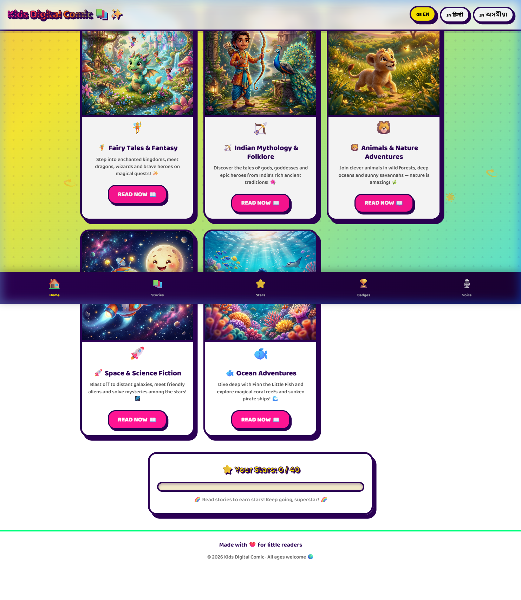
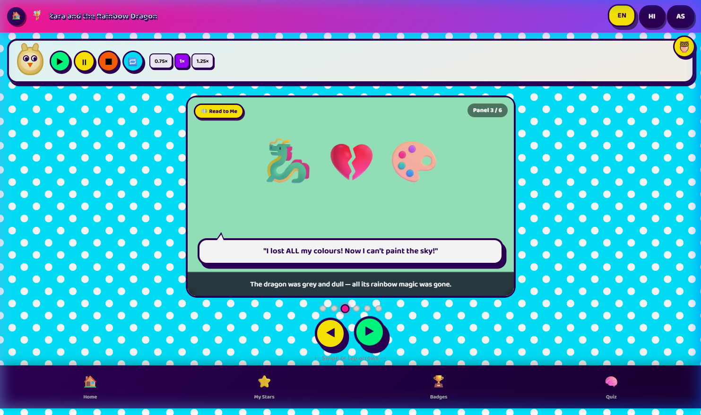
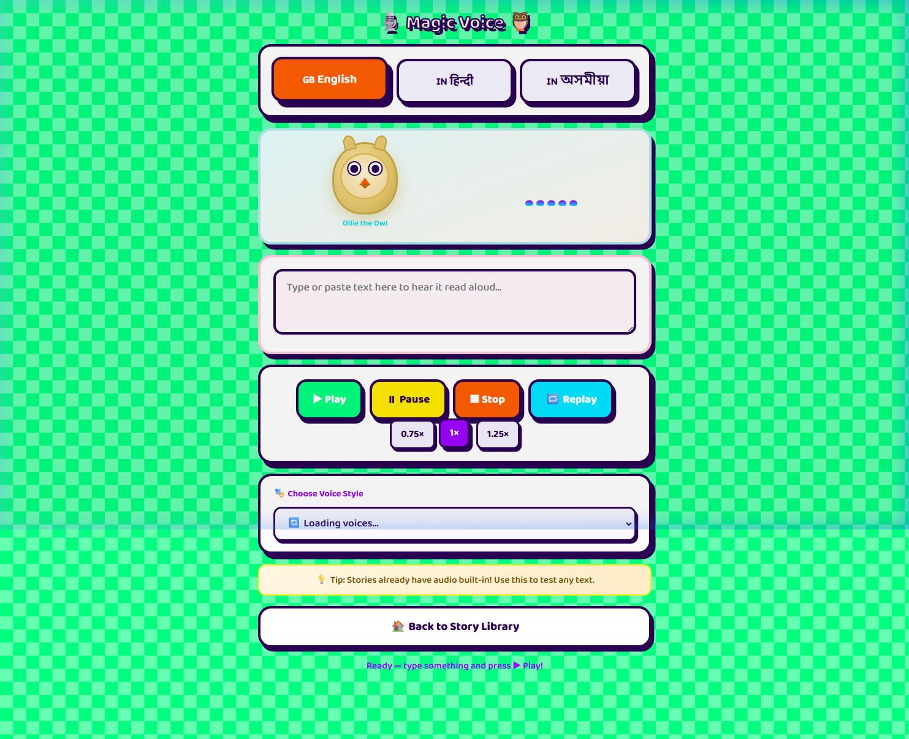
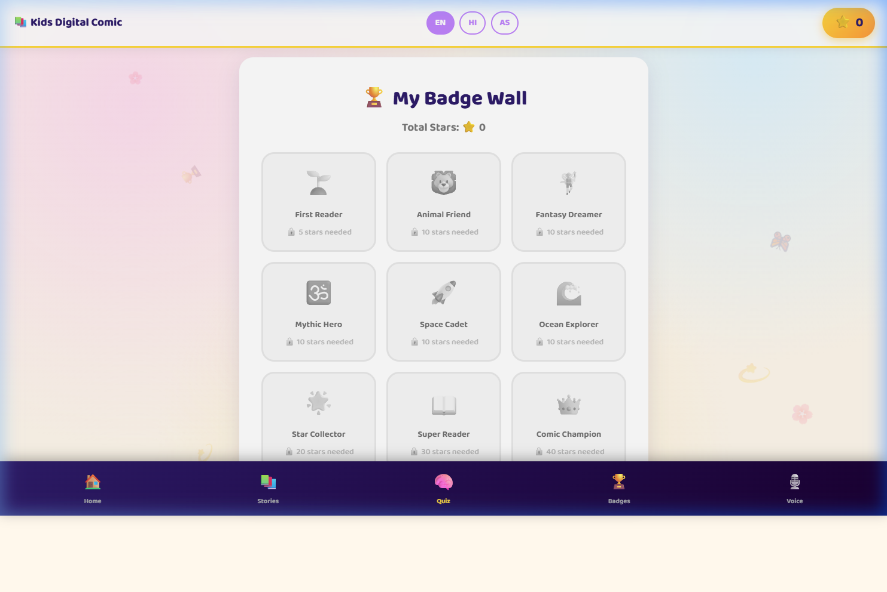

# Kids Digital Comic

A small, installable (PWA) web app that turns short stories into panel-by-panel comics for young readers. It supports audio narration, multiple languages, a story-specific quiz, and a rewards/badge system — all running entirely in the browser with no backend required.

> **Status:** Portfolio / learning project. Static site — runs locally from `index.html`.

---

## Features

- **5 illustrated stories** across themes: Fairy Tales, Indian Mythology, Animals, Space, Ocean
- **Panel-by-panel reader** with auto-advance, reading progress, and a "Continue reading" card
- **Audio narration** using the browser's built-in Web Speech API (no API keys needed). Optional premium ElevenLabs voices are wired in behind a safe backend-proxy pattern
- **3 languages**: English, Hindi (हिंदी), Assamese (অসমীয়া) for UI and narration prompts
- **Quizzes + rewards** — per-story quiz pool, stars, and animated confetti/badge screen
- **Progressive Web App** — installable on mobile / desktop via [manifest.json](manifest.json), offline-capable via [service-worker.js](service-worker.js)
- **Property-based tests** for panel navigation, quiz pool, fallback behavior, and service-worker registration (Vitest + fast-check)

---

## Tech stack

| Area              | Choice                                                 |
|-------------------|--------------------------------------------------------|
| Markup / layout   | Plain HTML5 + CSS (CSS variables, keyframes, grid)     |
| Interactivity     | Vanilla JavaScript (no framework)                      |
| Animation         | GSAP via CDN, canvas-confetti                          |
| Audio narration   | Web Speech API (built-in), optional ElevenLabs via proxy |
| Offline / install | Service Worker + Web App Manifest                      |
| Testing           | [Vitest](https://vitest.dev/) + [fast-check](https://fast-check.dev/) (property-based) |

No bundler, no build step — open [index.html](index.html) and it runs.

---

## Project structure

```
kids-digital-comic/
├── index.html              # Home / story picker
├── story-viewer.html       # Panel-by-panel reader
├── audio-narrator.html     # Standalone narration demo page
├── quiz-rewards.html       # Per-story quiz + rewards screen
├── service-worker.js       # Offline cache
├── manifest.json           # PWA manifest
├── config.example.js       # Copy to config.js to run locally
├── favicon.svg
├── assets/
│   ├── cover_*.png         # Story cover art
│   └── story_panels/       # Individual panel images per story
├── tests/
│   └── property/*.test.js  # Vitest + fast-check property tests
├── package.json
└── vitest.config.js
```

---

## Getting started

### 1. Clone

```bash
git clone https://github.com/<your-username>/kids-digital-comic.git
cd kids-digital-comic
```

### 2. Create your local config

```bash
cp config.example.js config.js        # macOS / Linux
copy config.example.js config.js      # Windows
```

`config.js` is git-ignored. The defaults use the browser's built-in TTS — nothing else to fill in.

### 3. Serve the site

Because the app uses a service worker and ES modules, open it through a local server (not `file://`). Any of these work:

```bash
# Option A — Python (no install needed on most systems)
python -m http.server 8000

# Option B — Node (any lightweight static server)
npx serve .

# Option C — VS Code
# Install the "Live Server" extension, right-click index.html → "Open with Live Server"
```

Then visit **http://localhost:8000** (or whatever port your server prints).

### 4. Run the tests

```bash
npm install
npm test          # one-shot
npm run test:watch
```

---

## Screenshots

> Recruiters / reviewers: screenshots live under [docs/screenshots/](docs/screenshots/).

### Home — story picker


### Story viewer — panel reader


### Audio narrator


### Quiz + rewards


---

## Notes on API keys

This repo contains **no API keys**. The ElevenLabs integration is optional and reads from a local `config.js` that is git-ignored. The safe pattern — documented in [config.example.js](config.example.js) — is to proxy ElevenLabs calls through your own backend (Cloudflare Workers / Netlify / Vercel) so the key never ships to the browser.

## License

Personal portfolio project — feel free to read, learn from, and adapt. Cover art and panel illustrations are placeholders generated for this demo and are not licensed for redistribution.
